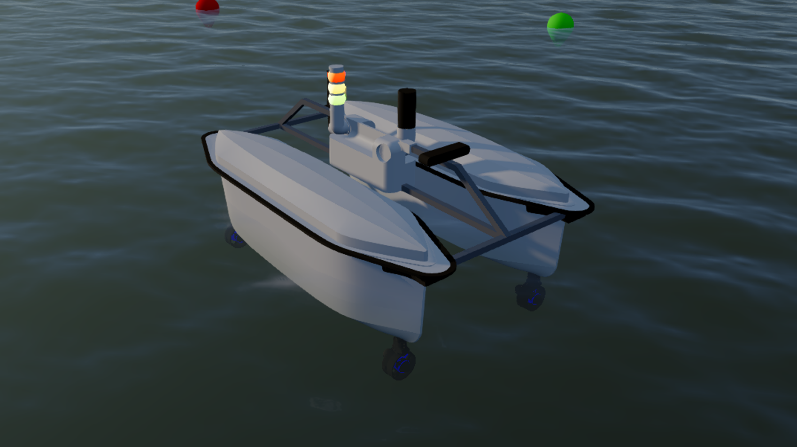
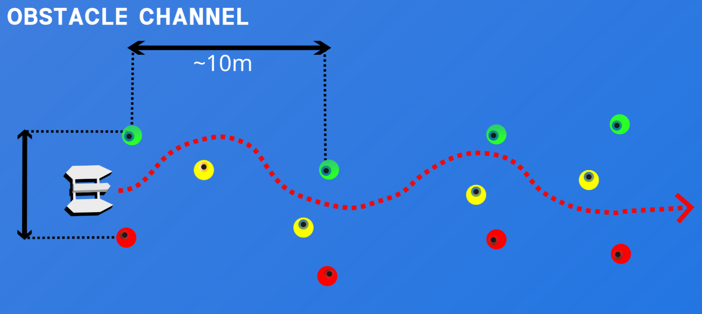
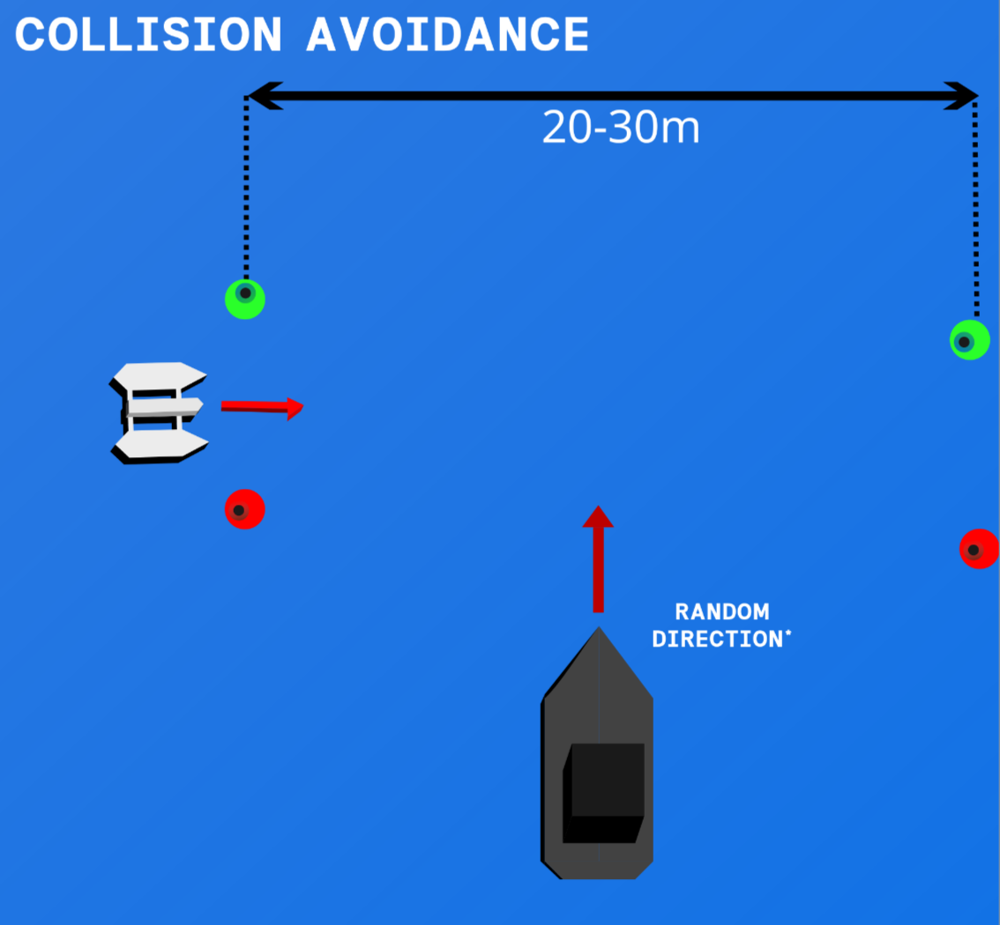
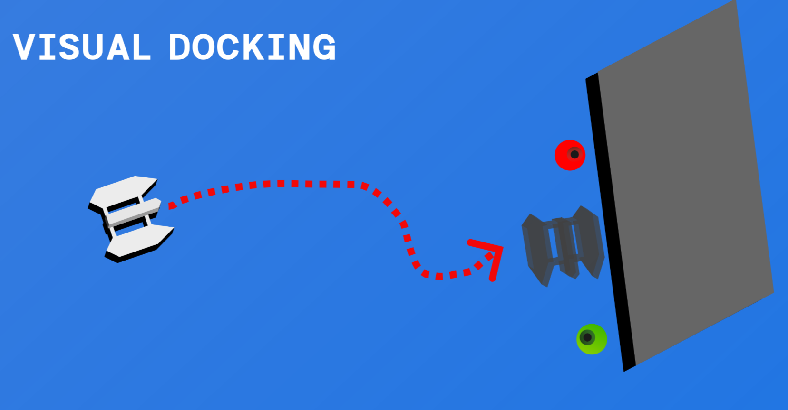
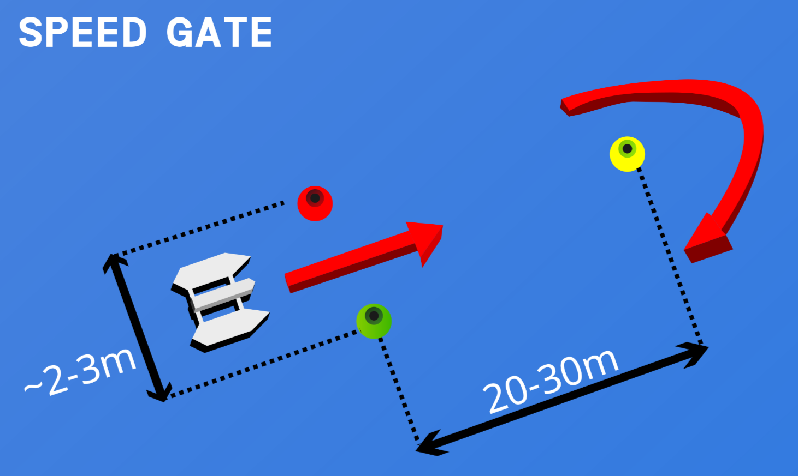

# USV SIMULATOR (README TO BE UPDATED)
The main goal of this project is to be able to simulate Sub-Horizon/Selene in a environment similar to Autodrone. 


The Autodrone competition consists of several challenges: 
| Obstacle Channel | Collision Avoidance |
| :---: | :---: |
|  |  |
| **Visual Docking** | **Speed Gate** |
|  |  |

The simulator environment provides a recreation of all of these scenarios.

## Dependencies

### ROS2 Humble 
The project is mostly developed and tested for the ROS2 Humble.
#### Distrobox
 If you're using a version of Ubuntu that is not equal to 22.04, we highly recommend using Distrobox. To setup distobox just use the following commands:
 install : 
```console
sudo apt install distrobox
```

Non NVIDIA GPU
```console
distrobox create -n ubuntu_2204 --image ubuntu:22.04
```
NVIDIA GPU:
```console
> distrobox create -n ubuntu_2204 --image ubuntu:22.04 --nvidia
```

After the distrobox is created you can enter the container by using the following command:
```console
distrobox enter ubuntu_2204
```

#### ROS2 Humble installation
Follow the guide at: [ROS2 Humble Installation](https://docs.ros.org/en/humble/Installation/Ubuntu-Install-Debs.html)


### Stonefish (Simulator software)
Stonefish is the framework used for creating the simulation, it provides a physicssimulator using Bullet Physics and visualization using OpenGL.

#### Installation

##### Dependencies
```console 
sudo apt install libsdl2-dev libglm-dev libasio-dev g++-13 
```

Stonefish could be downloaded by running the following commands, feel free to delete the folder after it is downloaded.
```console
git clone "https://github.com/patrykcieslak/stonefish.git"

cd stonefish

mkdir build && cd build && cmake ..

make -jX

sudo make install
```
Please refer to [Stonefish installation guide](https://stonefish.readthedocs.io/en/latest/install.html) if experiencing any issues.

### Ardupilot Software In The Loop (SITL)

Clone ardupilot into src/
```console
git clone --recurse-submodules git@github.com:Sub-Horizon-NTNU/ardupilot_selene.git

cd ardupilot_selene/ && ./Tools/environment_install/install-prereqs-ubuntu.sh -y 
```

### Micro XRCEDDS GEN
Start by installing the dependencies
```console
sudo apt install python3-vcstool python3-rosdep
 vcs import --recursive --input  https://raw.githubusercontent.com/ArduPilot/ardupilot/master/Tools/ros2/ros2.repos src

sudo rosdep init 
rosdep update
source /opt/ros/humble/setup.bash
rosdep install --from-paths src --ignore-src -r -y
```
#### Installing the MicroXRCEDDSGen build dependency:
```console
sudo apt install default-jre 

git clone --recurse-submodules https://github.com/ardupilot/Micro-XRCE-DDS-Gen.git

cd Micro-XRCE-DDS-Gen && ./gradlew assemble

echo "export PATH=\$PATH:$PWD/scripts" >> ~/.bashrc
```
#### Test it by running:
```console
source ~/.bashrc && microxrceddsgen -help
```
You should expect to get some output

### MAVProxy 
```console
sudo apt-get install python3-dev python3-opencv python3-wxgtk4.0 python3-pip python3-matplotlib python3-lxml python3-pygame

python3 -m pip install PyYAML mavproxy --user
```

### MAVROS 
MAVROS acts as a translator between mavlink and ROS, to install it run the following commands:
```console
sudo apt install ros-humble-mavros
```
Then install GeographicLib datasets by running the install_geographiclib_datasets.sh script:
```console
sudo /opt/ros/humble/lib/mavros/install_geographiclib_datasets.sh
```

### Other packages:
```console
sudo apt install ros-humble-xacro
```

## Build
After all the tiresome steps are completed it is time to build:

> colcon build

## Run
Then inside the usv simulator workspace run:
```console
source install/setup.bash
ros2 launch usv_simulator usv_simulator.launch.py gcs_url:=udp://@<your_gcs_ip>:<your_gcs_port>
```
You can then open a instance of QGroundControl or any other mavlink compatible mission planner.
## More updates to the project will defintly come. 
* Create more launch parameters such that the simulator can run without mavros and micro ros agent.
* Decouple simulator scenario such that more tasks/environments
